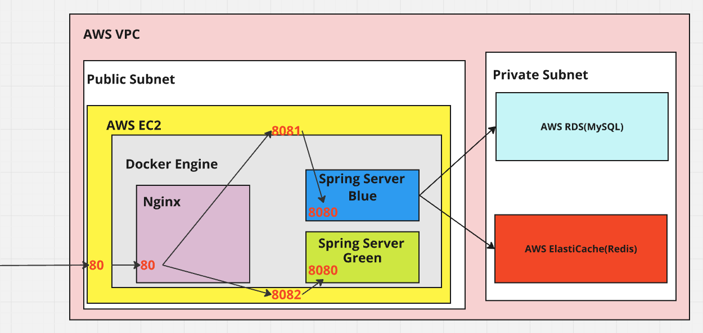
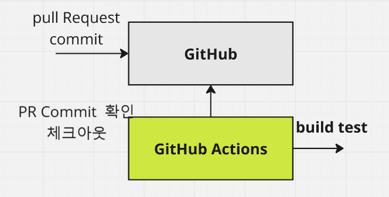
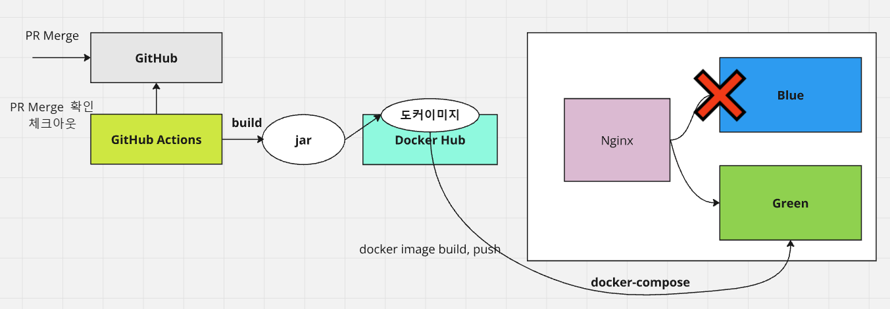
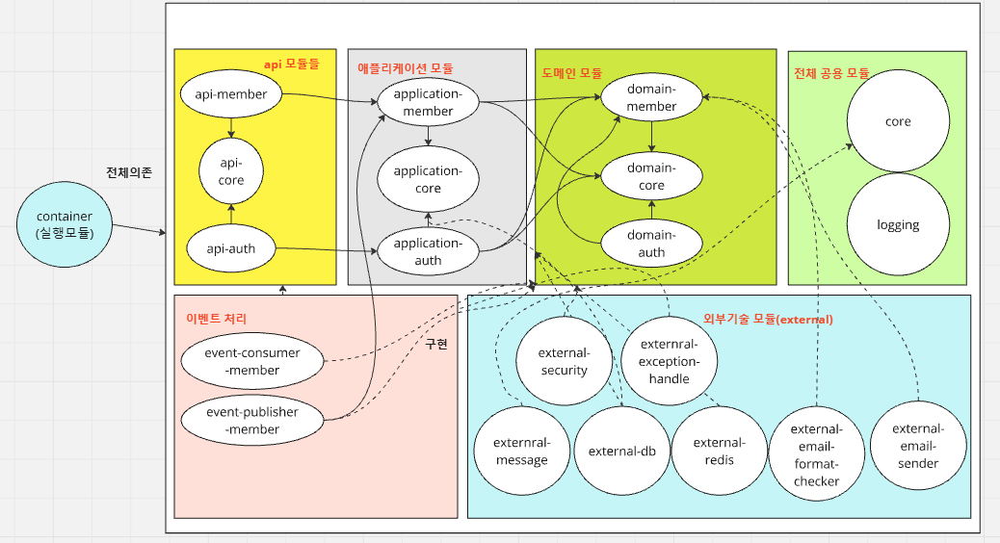
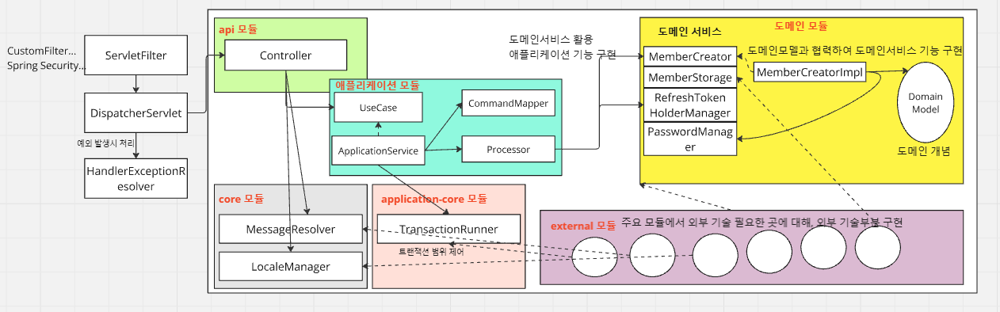
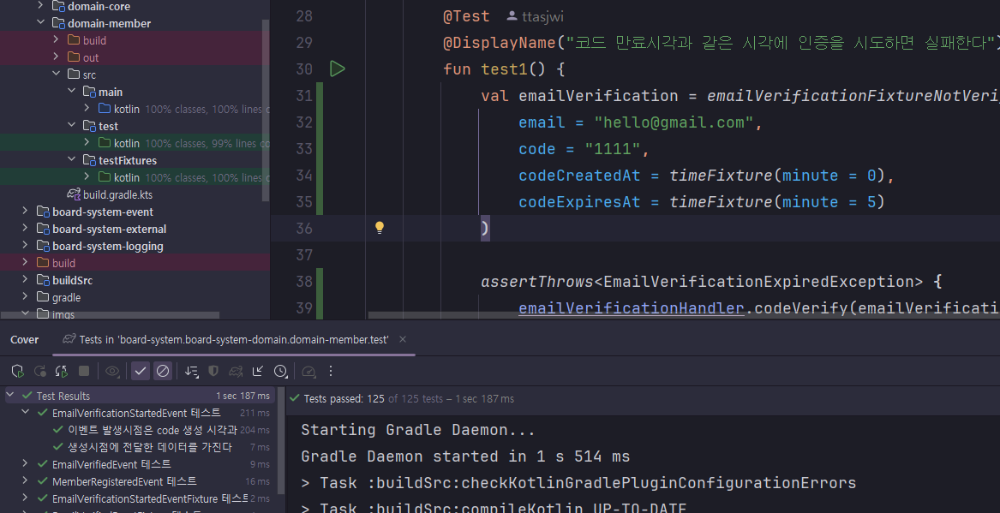
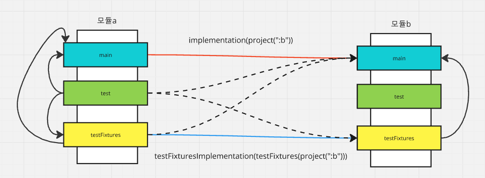
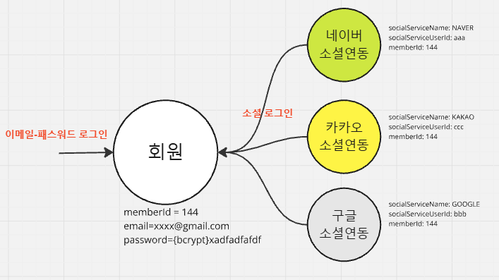
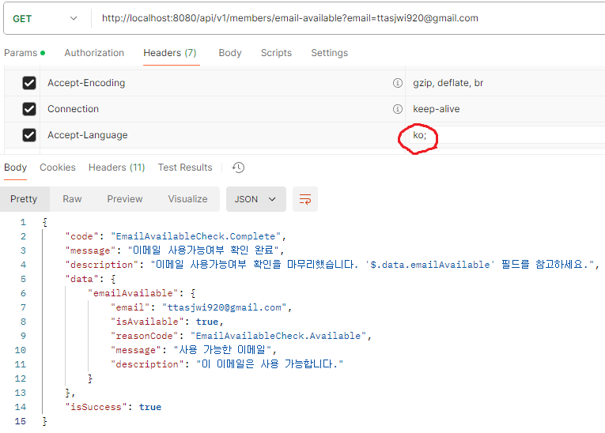
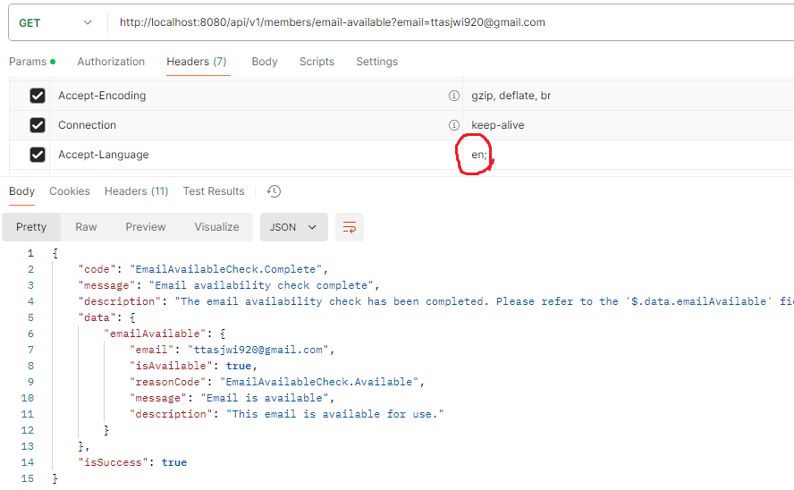

## 👋 Board-System (게시판 프로젝트)

### 📖 목차
- [🥅 프로젝트 개요](#-프로젝트-개요)
- [🛠️ 사용 기술](#-사용-기술)
- [🏛️ 애플리케이션 외부 아키텍처(인프라)](#-애플리케이션-외부-아키텍처인프라)
- [♾️ 지속적 통합, 지속적 배포](#-지속적-통합-지속적-배포)
- [🧱 애플리케이션 내부 아키텍처](#-애플리케이션-내부-아키텍처)
- [✅ 테스트 코드](#-테스트-코드)
- [🔑 인증/인가](#-인증인가)
- [🌏 메시지/국제화](#-메시지국제화)
- [📜 API 명세](#-api-명세)
- [📝 블로그 포스팅](#-블로그-포스팅)

---

### 🥅 프로젝트 개요
- API 개발 자체보다는 아키텍처 설계, Kotlin, 배포, 스프링 시큐리티 기능 등에 우선순위를 두고 만든 개인 토이 프로젝트입니다.
- 개발 비용이 많이 들더라도, 다른 분들과 팀 프로젝트 협업하는 상황에서는 개발 비용 등의 이유로 시도하기 힘든 아키텍처 설계 시행착오를
해보는 목적이 강했습니다.
- 전반적으로 구현한 코드들의 상당수는 다른 프로젝트에 적용할 수 있는 기능이기도 해서, 보일러 플레이트 프로젝트의 역할을 하기도 합니다.
- 백엔드 기능에 집중하고자, 화면구현 기능의 우선도는 높게 잡지 않았습니다.
- 블로그에 포스팅을 하면서 구현과정에서 어떤 고민을 했는지, 어떤 과정을 거치면서 구현해나갔는지 작성해뒀습니다.
- 취업 준비를 하면서 실시간으로 기능을 필요에 따라 구현해나가고 있습니다.

---

### 🛠️ 사용 기술
- 개발
  - 언어: Kotlin
  - 프레임워크 : Spring Framework
    - Spring Boot
    - Spring MVC
    - Spring Data JPA
    - Spring Data Redis
    - Spring Security, Spring Security OAuth2 Client, Spring Security JOSE(JWT)
  - 데이터베이스 : MySQL
- 배포
  - 구성: AWS EC2, Docker, Nginx
  - CI/CD: GitHub Actions (지속적 통합, 무중단 배포)
- 이슈 트래커: JIRA
- 형상관리: Git, GitHub

---

### 🏛️ 애플리케이션 외부 아키텍처(인프라)

- AWS의 프리티어 지원(일정 한도 내에서 12개월 무료로 서비스 이용)을 이용하여 인프라를 구성했습니다.
- EC2 인스턴스 내부에 도커 환경을 구축하고, Nginx 컨테이너와 애플리케이션 컨테이너(Blue, Green)를 구성했습니다.
- RDS(MySQL), ElastiCache(Redis) 를 통해 데이터를 저장합니다.

---

### ♾️ 지속적 통합, 지속적 배포

- Git을 통해 형상관리를 하고, GitHub 코드 베이스에 코드를 공유합니다.
- PR(Pull Request) 단위로 기능을 구현하고 PR에 새로운 커밋이 푸시될 때마다 빌드테스트가 작동하도록 자동화했습니다.(GitHub Actions)
- PR 브랜치 최신의 커밋이 빌드 과정에서 실패상태일 경우, Master 브랜치에 Merge 할 수 없도록 제약조건을 추가하여
Master 브랜치의 코드 신뢰도를 지속적으로 유지하도록 했습니다.

- 마스터 브랜치에 PR 브랜치가 Merge 될 경우, GitHub Actions 배포 스크립트를 실행하여 배포하도록 했습니다.
- 빌드를 거쳐서 만들어진 jar 파일로, 도커 이미지를 구성 및 DockerHub 저장소에 푸시하고 이를 EC2 인스턴스에서 끌어와서 컨테이너를
실행하게 했습니다.
- Blue/Green 방식을 사용한 **무중단 배포**를 적용했습니다.
  - 새로 컨테이너를 생성해 배포하고, 기존 배포되던 컨테이너를 중지합니다.
  - Nginx 가 가리키는 대상 서버를 변경하게 합니다.
  - 최종 사용자 입장에서는 이용 중단되지 않으면서 새로운 기능을 사용 가능합니다.

---

### 🧱 애플리케이션 내부 아키텍처

- 멀티모듈 기능을 프로젝트에 적용, 체험해보는 목적으로 멀티모듈 기능을 사용해봤습니다.
- 장점
  - 의존성 방향의 통제로, 변화가 발생했을 때 변화의 파급효과가 어디까지 미치는 지 예측하기 쉬워진 장점이 있었습니다.
  - 모듈마다 다루는 패키지의 종류가 줄어들고 집중화되어서 특정 기능의 코드를 찾는게 쉬워진 경우가 많아졌습니다.
  - 관심사에 따라 모듈을 나눈 결과, 특정 모듈 테스트 실행시 관심 밖의 모듈도 테스트하는 일이 없어져서 생산성이 향상된 감이 있었습니다.
- 단점
  - 프로젝트 전반을 여러 모듈로 쪼개는 것으로 인해, 초기 개발 단계의 프로젝트에서는 오버 엔지니어링이라는 느낌을 많이 받았습니다.

- 프로젝트 전반을 의존성 역전이 적용된 레이어드 아키텍처로 구성했습니다.
- 기본 계층: 표현계층(api, ...) - 애플리케이션 계층(application) - 도메인 계층(domain)
  - 표현계층: 사용자의 요청을 받아, 애플리케이션을 호출하여 비즈니스 로직 처리 후 응답을 가공하여 사용자에게 반환합니다.
  - 애플리케이션 계층: 사용자 요청을 애플리케이션 명령으로 변환 및 유효성 검증하고, 도메인 서비스를 응용하여 애플리케이션 기능을 구현합니다.
  - 도메인 계층: 서비스의 전반적인 주요 관심사, 도메인 개념을 정의하고 도메인에 관한 기본 처리 기능(도메인 서비스)을 제공합니다.
- 외부기술 계층(external): 외부기술 구현 
  - 기본 계층의 기능 구현 시, 외부 기술/도구가 필요한 경우 구현합니다.
  - 예) 데이터베이스, 레디스, 메시지/국제화 처리, 특정 라이브러리를 활용한 인증-인가 처리, ...

---

### ✅ 테스트 코드

- 작성하기 불편한 테스트코드는 아키텍처를 고쳐야한다는 신호로 인식하고, 실제 코드 개선에 반영하고 있습니다.
- 기본계층인 api 계층, 애플리케이션 계층, 도메인 계층에 대한 테스트 커버리지를 최대한 유지하도록 하고 있습니다.
(인텔리제이 기준 테스트 커버리지 100% 지향)
- 외부 기술을 사용하는 부분은 주요 지점에서 검증 코드를 작성하고 문제가 발생했을 때 추가적인 대응 및 테스트 보강하도록 하고 있습니다.
- CI/CD 스크립트의 빌드테스트 과정에서 함께 계속 실행되어, 테스트가 깨지는 코드가 배포되지 않도록 하고 있습니다.

- 테스트 픽스쳐를 활용하여 재사용성이 높은 테스트 준비과정을 간소화하고, 적극적으로 테스트 사용에 활용합니다.
- gradle의 java-test-fixtures 플러그인을 활용해, 다른 모듈의 테스트 픽스쳐를 재사용할 수 있게 했습니다. (모듈간 픽스쳐 재사용성 향상)

---

### 🔑 인증/인가

- 이메일-패스워드 로그인 방식을 지원합니다.
- 소셜 로그인 방식(Spring Security OAuth2 Client 활용)도 지원합니다. (Google, Kakao, Naver)
- 소셜 서비스의 이메일이 같은 경우 회원에 여러 서비스의 소셜 연동을 각 서비스별로 최대 1개씩 연결할 수 있습니다.

- 로그인(이메일-패스워드 방식, 소셜 로그인 방식 모두)을 하면 JWT 형태의 액세스토큰, 리프레시 토큰이 발행되도록 했습니다.
- 매 요청마다 액세스토큰을 전달하면 스프링 시큐리티에 만들어둔 커스텀 필터를 통해, 사용자의 신원을 확인하고
API 엔드포인트 접근 가능여부를 판별합니다.
- 리프레시토큰을 통해 액세스토큰 및 리프레시토큰을 갱신하여 사용할 수 있게 했습니다.

---

### 🌏 메시지/국제화

- 다국어 환경을 염두하여 API 응답 사양, 예외 클래스를 설계했습니다.
  - 로케일 : 스프링의 LocaleResolver 및 커스텀 로케일 설정 필터 구현
  - 메시지 : 스프링의 MessageSource 를 활용한 메시지/국제화 처리
  - 예외 : 예외마다 메시지를 Code 를 갖게 하고, Code를 사용하여 메시지를 구성할 수 있도록 했습니다.

---

### 📜 API 명세
(Wiki 에 작성해두고, 이후 시간 여유가 생기면 Spring Rest Docs, Swagger 등의 도구를 이용하도록 변경할 예정)
- [이메일 유효성 확인](https://github.com/ttasjwi/board-system/wiki/%EC%9D%B4%EB%A9%94%EC%9D%BC-%EC%9C%A0%ED%9A%A8%EC%84%B1-%ED%99%95%EC%9D%B8-API)
- [아이디 유효성 확인](https://github.com/ttasjwi/board-system/wiki/%EC%95%84%EC%9D%B4%EB%94%94-%EC%9C%A0%ED%9A%A8%EC%84%B1-%ED%99%95%EC%9D%B8-API)
- [닉네임 유효성 확인](https://github.com/ttasjwi/board-system/wiki/%EB%8B%89%EB%84%A4%EC%9E%84-%EC%9C%A0%ED%9A%A8%EC%84%B1-%ED%99%95%EC%9D%B8-API)
- [인증이메일 발송](https://github.com/ttasjwi/board-system/wiki/%EC%9D%B8%EC%A6%9D%EC%9D%B4%EB%A9%94%EC%9D%BC-%EB%B0%9C%EC%86%A1-API)
- [이메일 인증](https://github.com/ttasjwi/board-system/wiki/%EC%9D%B4%EB%A9%94%EC%9D%BC-%EC%9D%B8%EC%A6%9D-API)
- [회원가입](https://github.com/ttasjwi/board-system/wiki/%ED%9A%8C%EC%9B%90%EA%B0%80%EC%9E%85-API)
- [로그인](https://github.com/ttasjwi/board-system/wiki/%EB%A1%9C%EA%B7%B8%EC%9D%B8-API)
- [토큰 재갱신](https://github.com/ttasjwi/board-system/wiki/%ED%86%A0%ED%81%B0-%EC%9E%AC%EA%B0%B1%EC%8B%A0-API)
- [소셜 서비스 인가](https://github.com/ttasjwi/board-system/wiki/%EC%86%8C%EC%85%9C-%EC%84%9C%EB%B9%84%EC%8A%A4-%EC%9D%B8%EA%B0%80-API)
- [소셜 로그인](https://github.com/ttasjwi/board-system/wiki/%EC%86%8C%EC%85%9C-%EB%A1%9C%EA%B7%B8%EC%9D%B8-API)

---

### 📝 블로그 포스팅
프로젝트를 진행해나가는 상세한 과정은 블로그에 게시했습니다.

- [1. 기획](https://ttasjwi.tistory.com/153)
- [2. AWS 환경 구성](https://ttasjwi.tistory.com/154)
- [3. 프로젝트 생성 및 지속적 통합](https://ttasjwi.tistory.com/155)
- [4. 지속적 무중단 배포(AWS EC2, GitHub Actions, Docker, Nginx)](https://ttasjwi.tistory.com/156)
- [5. 프로젝트 멀티모듈화](https://ttasjwi.tistory.com/157)
- [6. 커스텀 예외, core 모듈](https://ttasjwi.tistory.com/158)
- [7. 로깅 모듈](https://ttasjwi.tistory.com/159)
- [8. 메시지,국제화 / API 응답 규격](https://ttasjwi.tistory.com/160)
- [9. API 예외 메시지 처리](https://ttasjwi.tistory.com/161)
- [10. 애플리케이션 내부 아키텍처 설계](https://ttasjwi.tistory.com/162)
- [11. 멀티모듈과 테스트 픽스쳐 중복문제](https://ttasjwi.tistory.com/163)
- [12. 이메일/사용자 아이디/닉네임 사용가능 여부 확인 API 구현](https://ttasjwi.tistory.com/164)
- [13. 데이터베이스 접근기술 적용](https://ttasjwi.tistory.com/165)
- [14. 인증 이메일 발송 API 구현](https://ttasjwi.tistory.com/166)
- [15. 이메일 인증 API 구현](https://ttasjwi.tistory.com/167)
- [16. 회원가입 API 구현](https://ttasjwi.tistory.com/168)
- [17. 로그인 API 구현 - (1) 설계](https://ttasjwi.tistory.com/169)
- [18. 로그인 API 구현 - (2) JWT 기술 적용](https://ttasjwi.tistory.com/170)
- [19. Redis 연동](https://ttasjwi.tistory.com/171)
- [20. 스프링 시큐리티와 사용자 인증/인가](https://ttasjwi.tistory.com/172)
- [21. 리프레시토큰을 통한 토큰 재갱신 기능 구현](https://ttasjwi.tistory.com/173)
- [22. 스프링 시큐리티 OAuth2 Client 를 사용한 소셜 로그인 (1) 설정 준비](https://ttasjwi.tistory.com/174)
- [23. 스프링 시큐리티 OAuth2 Client 를 사용한 소셜 로그인 (2) 인가 엔드포인트 리다이렉트](https://ttasjwi.tistory.com/175)
- [24. 스프링 시큐리티 OAuth2 Client 를 사용한 소셜 로그인 (3) 소셜서비스 사용자 정보 획득](https://ttasjwi.tistory.com/176)
- [25. 스프링 시큐리티 OAuth2 Client 를 사용한 소셜 로그인 (4) 로그인/회원가입](https://ttasjwi.tistory.com/177)

---
