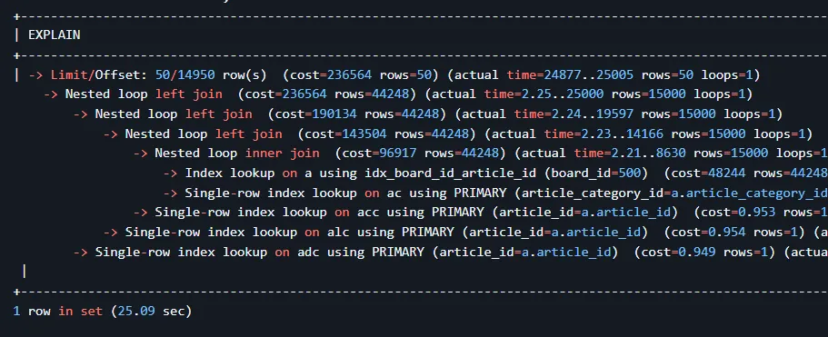
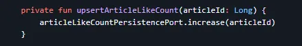
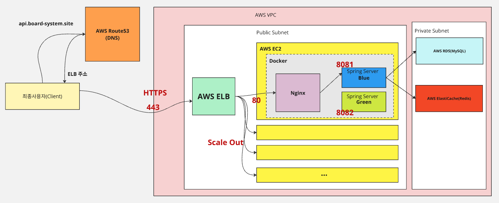
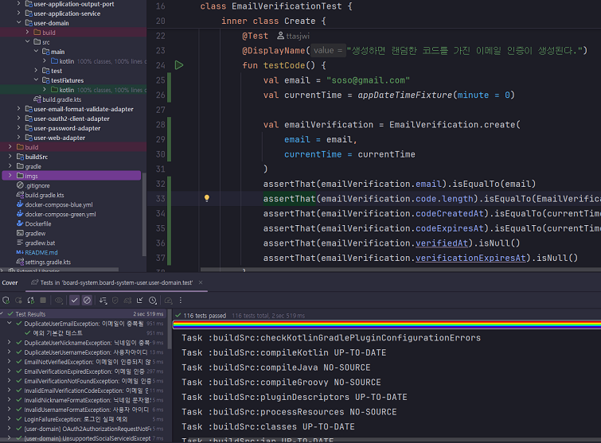

# 👋 Board-System (게시판 프로젝트)

## 🥅 프로젝트 개요
- 서비스 설명 : 사용자들이 누구나 게시판을 만들 수 있고, 게시판을 통해 정보, 일상 공유를 할 수 있도록 하기 위한 Restful API 형태의 커뮤니티 서비스
    - 백엔드 기능에 집중하고자, 프론트엔드 기능 구현은 하지 않았습니다.
- Github 링크 : https://github.com/ttasjwi/board-system
- 주요기능 : 로그인/소셜로그인, 게시글 기능, 게시글 좋아요/싫어요 기능, 게시글 댓글 기능, 게시글 조회수 기능, …
- Kotlin, Spring Boot, MySQL, Redis, JPA, AWS(EC2, RDS, ElastiCache), Docker, Github Actions, K6, ...

---

## 🛠️ 기술/문제해결 상세

### [[부하테스트를 통한 대용량 트래픽 처리 간접 경험]](https://github.com/ttasjwi/board-system/wiki/%EB%B6%80%ED%95%98%ED%85%8C%EC%8A%A4%ED%8A%B8-%E2%80%90-(4)-%EA%B2%8C%EC%8B%9C%EA%B8%80-%EB%AA%A9%EB%A1%9D-%ED%8E%98%EC%9D%B4%EC%A7%80-%EC%A1%B0%ED%9A%8C-%EB%B6%80%ED%95%98%ED%85%8C%EC%8A%A4%ED%8A%B8)
- 도입배경
    - 서비스 기능은 테스트 코드로 어느 정도 검증했지만, 실제로 많은 동시 사용자 요청이 들어왔을 때 성능이 유지될 수 있는지는 확인할 수 없었습니다.
    - 특히, 대규모 데이터가 삽입된 운영 환경과 유사한 조건에서의 성능을 검증하는 경험이 필요하다고 판단했습니다.
- 문제 해결 과정: 직접적인 트래픽 경험은 어렵지만, 이를 대체할 수 있는 환경을 구성해보기로 했습니다.=
    - 회원 1,200만 건, 게시글 2,400만 건, 댓글 2,400만 건 등 대규모 데이터를 삽입하여 운영 환경에 가까운 데이터 스케일을 구성했습니다.
    - 단순히 로컬 컴퓨터 테스트에서 그치지 않고, AWS EC2 인스턴스에 실제로 서비스를 배포함으로서 실무와 유사한 환경을 구성했습니다.
    - 부하 테스트 도구로는 오픈소스인 `k6`를 사용했습니다. `k6`는 가볍고, 설치 및 설정이 간편하며, 부하 생성 능력도 충분해 선택하게 되었습니다.
    - 동시 요청 수를 1명부터 50명(많게는 1,000명)까지 점진적으로 증가시키며, 요청 처리 가능 수와 응답 시간의 변화 등을 측정했습니다.
- 성과  
    

    

  - 로컬 테스트에서는 원활하게 동작하던 기능이었지만, 실제 부하 테스트 결과 응답 속도가 최대 30초까지 치솟고, TPS가 불안정해지는 현상을 발견할 수 있었습니다.
  - CloudWatch를 통해 RDS의 CPU 사용률은 급증한 반면 EC2는 낮은 수준을 유지하고 있다는 점에서 **DB 성능 병목이 원인**임을 파악할 수 있었습니다.
  - 이를 계기로 **DB 인덱싱 최적화, 조회 쿼리 개선, 커버링 인덱스 활용** 등 성능 개선을 진행했고, 그 결과는 아래 항목에서 상세히 서술하였습니다.

### [[데이터베이스 인덱스를 추가하여, 게시글 목록 조회 성능 36배 향상]](https://github.com/ttasjwi/board-system/wiki/%EB%B6%80%ED%95%98%ED%85%8C%EC%8A%A4%ED%8A%B8-%E2%80%90-(5)-%EA%B2%8C%EC%8B%9C%EA%B8%80-%EB%AA%A9%EB%A1%9D-%ED%8E%98%EC%9D%B4%EC%A7%80-%EC%A1%B0%ED%9A%8C-%EC%84%B1%EB%8A%A5-%EA%B0%9C%EC%84%A0-(%EC%9D%B8%EB%8D%B1%EC%8A%A4))
- 도입배경
    - 부하 테스트 결과, 게시글 수가 약 2,400만 건에 이르는 상황에서 게시글 목록 조회 속도가 급격히 느려지는 현상을 확인했습니다.
- 문제 원인 분석  
    

  - MySQL의 실행 계획 도구(`EXPLAIN`, `EXPLAIN ANALYZE`)를 활용해 쿼리의 비효율적인 실행 방식을 분석했습니다.
  - 분석 결과, 기존 쿼리는 모든 테이블을 풀스캔한 뒤 조건에 맞는 게시글을 필터링하고, 정렬 및 Offset을 적용해 `LIMIT` 수만큼 조회하는 방식이었습니다.
  - 이는 정렬 기준이 인덱스에 포함되어 있지 않아, 매번 정렬 및 필터링 연산이 추가 발생하고 있었고, 이로 인해 성능이 크게 저하되었습니다.
- 개선방향  
    
  
    

  - MySQL이 필터링과 정렬 없이도 효율적으로 게시글을 조회할 수 있도록 **멀티 컬럼 인덱스**를 추가했습니다.
    - 인덱스 구성: `board_id ASC, article_id DESC`
  - 이 인덱스는 “특정 게시판 내에서 최신 게시글 목록을 페이지 단위로 조회” 하는 패턴과 완전히 일치합니다.
  - 인덱스가 적용된 이후, MySQL은 더 이상 테이블 풀스캔 없이 인덱스 레인지 스캔만으로 필요한 게시글을 빠르게 조회할 수 있게 되었습니다.
- 성과  
    

    

  - 실행 계획 확인 결과, 쿼리가 새로 생성한 인덱스를 정확히 활용하는 것을 확인했습니다.
  - 인덱스 상에서 게시글들이 게시판별로 최신순으로 정렬되어 있어 추가적인 정렬 작업 없이 효율적으로 조회가 가능해졌습니다.

    

  - 부하 테스트 성과
      - 개선 전: 낮은 동시 사용자 수(VUs)에서도 TPS가 불안정
      - 개선 후: TPS가 VUs 23 부근에서 **최대 20.8**까지 상승, 부하를 안정적으로 처리
  - API 응답 속도 비교
      - 개선 전: 500번 게시판의 20페이지 조회 시 약 **1,550ms**
      - 개선 후: 동일 조건에서 약 **43ms**  
        → 약 **36배 성능 향상**
  - [이와 비슷한 방식으로 댓글 목록 조회 성능 역시 대폭 성능을 향상시켰습니다.](https://github.com/ttasjwi/board-system/wiki/%EB%B6%80%ED%95%98%ED%85%8C%EC%8A%A4%ED%8A%B8-%E2%80%90-(9)-%EA%B2%8C%EC%8B%9C%EA%B8%80-%EB%8C%93%EA%B8%80-%EB%AA%A9%EB%A1%9D-%ED%8E%98%EC%9D%B4%EC%A7%80-%EC%A1%B0%ED%9A%8C-%EC%84%B1%EB%8A%A5-%EA%B0%9C%EC%84%A0(%EC%9D%B8%EB%8D%B1%EC%8A%A4))
    - 개선 전: 1시간이 넘도록 댓글 목록 조회 응답이 오지 않음. (성능 확인 불가능 수준)
    - 개선 후: 104ms 만에 댓글 목록 조회 응답이 오도록 API 성능 개선

### [[비정규화, 쿼리 튜닝을 통해 게시글 목록 조회 성능 10배 추가 향상]](https://github.com/ttasjwi/board-system/wiki/%EB%B6%80%ED%95%98%ED%85%8C%EC%8A%A4%ED%8A%B8-%E2%80%90-(6)-%EA%B2%8C%EC%8B%9C%EA%B8%80-%EB%AA%A9%EB%A1%9D-%ED%8E%98%EC%9D%B4%EC%A7%80-%EC%A1%B0%ED%9A%8C-%EC%84%B1%EB%8A%A5-%EA%B0%9C%EC%84%A0-(%EA%B2%8C%EC%8B%9C%EA%B8%80%EC%88%98-%EB%B9%84%EC%A0%95%EA%B7%9C%ED%99%94,-%EC%BF%BC%EB%A6%AC-%ED%8A%9C%EB%8B%9D))
- 도입배경
    - 인덱스를 적용해 36배의 성능 향상을 이루었지만, 인기 게시판에서 페이지 번호가 1,000 이상으로 커질 경우 여전히 성능 저하가 발생하는 것을 확인했습니다.
- 문제 원인 분석  
    

  - 페이지 번호가 커질수록 `OFFSET`이 커지고, 그로 인해 조회 시간이 급격히 늘어납니다.
  - 게시글 목록을 조회할 때 전체 게시글 수를 구하기 위한 `COUNT(*)` 쿼리도 성능 저하의 원인이 됩니다.
  - 또한, 조회 대상 게시글에 포함된 컬럼들이 인덱스에 존재하지 않으면 테이블 접근이 발생하고, 이는 Disk I/O 증가로 이어집니다.
  - 따라서 인덱스만으로 정렬·필터링하고, 실제 테이블 접근은 필요한 경우에만 최소화하는 방향이 필요했습니다.
- 개선 방향
    - 페이지 번호 제한: 과도한 `OFFSET`으로 인한 비효율을 방지하기 위해 페이지 번호를 1~100 사이로 제한했습니다.
    - 게시글 수 비정규화: 게시판 별 게시글 수를 별도 테이블에서 관리함으로써 `COUNT(*)` 없이도 총 페이지 수를 빠르게 계산할 수 있도록 했습니다.
    - **쿼리 튜닝 (CTE + 커버링 인덱스)**:  
        

      -`OFFSET` 접근 시 성능 저하를 줄이기 위해 커버링 인덱스가 적용되는 형태로 쿼리를 재구성했습니다.
      - 하나의 쿼리 안에서 CTE(Common Table Expression) 를 활용하여, 먼저 인덱스만으로 원하는 게시글 `ID` 목록을 추출한 뒤, 해당 ID들을 기준으로 실제 게시글 정보를 조회하는 방식입니다.
      - 예시 쿼리:
       ```mysql
       WITH cte(article_id) AS (
           SELECT article_id
           FROM articles
           WHERE board_id = 1
           ORDER BY article_id DESC
           LIMIT 50 OFFSET 199950
       )
       SELECT ...
       FROM articles a
       JOIN cte ON a.article_id = cte.article_id
       ...
       ```
      - `CTE` 내부의 `SELECT`는 인덱스 컬럼(`board_id, article_id`)만을 조회하여 디스크 접근 없이 인덱스 레벨에서 빠르게 처리됩니다.
      - 이후 본문 쿼리에서는 `JOIN`을 통해 필요한 정보만 테이블에서 조회함으로써 Disk I/O를 최소화하고, 정렬/필터링 비용도 줄이는 구조를 구현했습니다.
- 성과
    - 개선 전:
      - 최대 TPS: 20.8 (VUs 23 기준)
      - RDS가 병목 지점
    - 개선 후:  
        

        

      - 최대 TPS: **207.5** (VUs 224 기준, **10.4배 향상**)
      - RDS CPU 사용률: 21.4%로 감소
      - EC2 CPU 사용률: 99%에 도달 → 병목이 EC2로 이동
    - 이를 통해 병목 원인을 **RDS → EC2** 로 이동시킬 수 있었고, 이후 처리량을 더 높이기 위해서는 EC2 인스턴스를 수평 확장하는 방안이 필요함을 확인했습니다. 다만 테스트 환경 비용 등의 이유로 실제 확장은 진행하지 않았습니다.

### [[좋아요 수 증가 방식을 변경하여, 좋아요 수 동시성 문제 해결]](https://github.com/ttasjwi/board-system/wiki/%EA%B2%8C%EC%8B%9C%EA%B8%80-%EC%A2%8B%EC%95%84%EC%9A%94-%EC%88%98-%EB%8F%99%EC%8B%9C%EC%84%B1-%EB%AC%B8%EC%A0%9C-%ED%95%B4%EA%B2%B0)
- 도입배경  
    

  - 게시글에 "좋아요"를 누를 수 있는 기능을 구현했으며, 좋아요 수는 조회 성능을 높이기 위해 비정규화된 형태로 별도로 저장하고 있었습니다.
  - 그러나 수천 명의 사용자가 동시에 같은 게시글에 좋아요 요청을 보낼 경우, 기대값보다 적은 수의 좋아요가 반영되는 현상이 발생했습니다.
  - 예를 들어, 3000명이 동시에 요청했음에도 좋아요 수는 3000이 아닌 302 정도만 증가하는 문제가 있었습니다.
- 문제 원인 분석  
    

  - 해당 현상은 좋아요 수를 조회 → 증가 → 저장하는 기존의 구현 방식이 트랜잭션 간 충돌에 취약한 구조였기 때문에 발생했습니다.
  - 다수의 트랜잭션이 동일한 좋아요 수 레코드를 거의 동시에 조회하고, 각자의 상태에서 1을 증가시킨 후 저장하는 방식이었기 때문에 동시성 문제가 발생했고, 이로 인해 최종 결과가 덮어써지는 문제가 있었습니다.
  - 특히 좋아요 수 레코드가 존재하지 않는 경우 초기화 과정에서도 중복 INSERT 충돌이 발생할 수 있어, 단순히 락을 걸어도 완전한 해결이 어려운 구조였습니다.
- 문제해결 방안 고민
    - 낙관적 락 (Optimistic Lock)
        - `version` 필드를 통해 충돌을 감지하고 재시도합니다.
        - 구현은 간단하지만, 동시 요청이 많을 경우 충돌률이 높아 성능 저하 우려가 있습니다.
        - 최초 좋아요수 초기화 시 행 자체가 존재하지 않으므로 중복 insert 충돌 문제를 해결할 수 없습니다.
    - 비관적 락 (Pessimistic Lock)
        - `SELECT ... FOR UPDATE` 를 사용해 행에 배타적 락을 걸고 순차적으로 처리합니다
        - 정확도는 보장되지만, 병목 가능성과 데이터베이스 부하 증가 우려가 있습니다.
        - 최초 좋아요수 초기화 시 행 자체가 존재하지 않으므로 중복 insert 충돌 문제를 해결할 수 없습니다.
    - Redis 기반 분산 락
        - Redis 의 SetIfAbsent 기능을 활용한 분산락을 통해 게시글 좋아요 기능에 동시 접근 제한을 둡니다.
        - 최초 좋아요수 초기화 를 하는 상황에도 Redis 를 통해 락을 획득하므로, 중복 insert 충돌 문제를 해결할 수 있긴 합니다.
        - 신뢰성이 높지만 인프라 복잡도 및 비용이 증가합니다.
    - 초기화 시점 변경 + 낙관적락 / 비관적락 사용
        - 게시글 생성 시 좋아요 수를 함께 초기화 생성하여 최초 좋아요 시점에도 ‘좋아요 수’가 이미 존재하게 하는 방법입니다.
        - 위의 낙관적 락 / 비관적락 방식을 사용 가능하게 합니다.
        - 하지만 게시글 맥락에서 ‘게시글 좋아요’ 맥락을 의존하게 되므로, 맥락간 개념 순환참조 문제가 발생하게 됩니다.
- 해결책  
    

    

  - 기존 구조의 복잡도와 성능 문제를 해결하면서도 락 없이 정확성을 보장할 수 있는 방법으로, MySQL의 `INSERT ... ON DUPLICATE KEY UPDATE` 쿼리 사용으로 문제를 해결했습니다.
      - 좋아요 수를 조회하고 객체를 조작하는 대신, ****매 요청 시점마다 DB에 직접 INSERT 시도
      - 이미 해당 게시글에 대한 좋아요 수 레코드가 존재할 경우, 중복키 충돌을 유도해 `UPDATE` 로 전환
      - 결과적으로 DB 상태를 기준으로 즉시 1 증가시키는 원자 연산이 수행됨
  - 이 방식은 다음과 같은 장점이 있습니다.
      - 락을 사용하지 않아도 동시성 문제를 해결할 수 있습니다.
      - 좋아요 수 객체의 존재 유무와 관계없이 동일한 쿼리로 처리할 수 있습니다.
      - 추가적인 인프라 비용 투자 없이도 정확성과 성능을 모두 확보 가능
- 성과  
    

    

  - 기존에는 수천 명이 동시에 요청해도 수십 건만 반영되던 문제가, 3000명이 동시에 좋아요 요청 시 정확히 3000건이 반영되도록 개선됐습니다.
  - Redis 등 외부 캐시나 락 저장소를 도입하지 않고도, 데이터베이스(MySQL)의 기능만으로 정합성과 성능을 모두 달성했습니다.
  - 데이터 조작 로직이 도메인 객체 중심이 아닌 DB 연산 중심이 되는 점에서 다소 아쉬움이 있지만, 정합성, 성능 문제를 모두 만족시키는 실용적인 선택이였다고 생각합니다.

### [[Redis 기반 분산락을 활용하여 게시글 조회수 증가 어뷰징 문제 해결]](https://github.com/ttasjwi/board-system/wiki/%EA%B2%8C%EC%8B%9C%EA%B8%80-%EC%A1%B0%ED%9A%8C%EC%88%98-%EA%B8%B0%EB%8A%A5-%EC%84%A4%EA%B3%84(--%EC%96%B4%EB%B7%B0%EC%A7%95-%EB%B0%A9%EC%A7%80))

- 도입배경  
    

  - 우리 서비스에서는 사용자 조회수 증가 API 를 별도로 관리하고 있습니다. 사용자가 요청을 하면 게시글의 조회수가 1 증가합니다.
  - 그러나 동시에 특정 사용자가 악용 목적으로 게시글 조회수 증가를 동시에 매우 많이 요청할 경우, 게시글 조회수가 순식간에 폭증하는 문제가 발생합니다. (악용, 어뷰징)
- 개선  
    

  - 기존 로직에, '게시글 조회수 락' 획득 로직을 추가했습니다
  - 사용자는 요청할 때마다 게시글 조회수 락 획득을 시도합니다. 락 획득에 성공하면 게시글 조회수 증가 로직을 수행하고, 락 획득에 실패하면 조회수 증가를 하지 않습니다.

    

  - Redis 에서는 setIfAbsent 라는 기능을 제공합니다.
    - key 가 존재하지 않으면 value 를 저장할 수 있습니다. 저장에 성공하면 true 가 반환됩니다.(ttl 지정 가능)
    - key 가 존재하면 value를 저장할 수 없습니다. 이 경우 false가 반환됩니다.
  - 최초 락 획득 시도시, 10분간 유효하도록 setIfAbsent 를 호출하여, 10분간 value 를 저장할 수 없게 하는 것입니다.
    - 최초 요청 시 set에 성공하면 true 가 반환되는데(10분간 저장됨) 이를 락 획득 성공으로 간주합니다.
    - 이후 10분간 요청 시 false 를 반환받는데, 이를 락 회득 실패로 간주하게 하면 됩니다.
  - 이 기능을 활용하여 분산락을 구현할 수 있습니다.
- 성과  
    

  - 동시에 한 사용자가 1만번 조회수 증가 요청을 하게 시뮬레이션 한 결과(100개 스레드), 조회수는 1 정도만 증가하는 것을 확인했습니다.
  - 10분 이내로 같은 사용자가 조회수 증가 어뷰징을 하더라도 조회수가 폭증하는 어뷰징 현상을 막을 수 있게 됐습니다.

---

### GitHub Actions 를 활용한 CI/CD 파이프라인 구축(with. Docker)
- 도입 배경
    - 코드 변경 시, 기존 기능과의 통합이 제대로 이루어졌는지를 매번 수동으로 확인해야 했습니다.
    - 애플리케이션 배포 과정도 수작업으로 진행했기 때문에, 무중단 배포를 실수 없이 수행하기 어려운 구조였습니다.
    - 테스트 및 배포 작업에 소요되는 시간도 길어 개발 생산성을 떨어뜨리는 원인이 되었습니다.
- 개선 방향  
    

  GitHub Actions와 Docker를 활용하여 **CI/CD 파이프라인을 자동화**하고, EC2 + Nginx 기반의 무중단 배포 구조를 구축했습니다.
    - CI 단계:
        - PR 생성 시 자동으로 빌드 및 테스트 실행
        - 테스트 실패 시 병합 차단 → **코드 품질 보장**
    - CD단계:
      `master` 브랜치에 병합되면 자동으로 배포 파이프라인 실행

        1. JAR → Docker 이미지 생성
        2. DockerHub로 Push
        3. EC2 서버에서 이미지 Pull 및 새 컨테이너 실행
        4. 헬스체크 완료 시, Nginx의 리버스 프록시 라우팅 변경
        5. 이전 버전 컨테이너 종료 및 불필요한 이미지 정리
    - **환경 간 일관성 확보**:
        - Docker를 통해 배포 환경을 컨테이너화함으로써, 환경 차이에 의한 배포 오류 방지
        - EC2 인스턴스 어디서든 **동일한 환경 조건**으로 애플리케이션 실행 가능
- 성과
    - 자동화된 테스트 및 배포로 실수 가능성 감소 및 개발 생산성 향상
    - 무중단 배포 구현: 기존 트래픽 처리 중인 컨테이너에 영향을 주지 않고 새 버전으로 안전하게 전환
    - Docker 기반 컨테이너 격리를 통해, 컨테이너 내부 서비스 장애가 발생해도 호스트 환경에는 영향이 없습니다.

### [의존성 역전을 고려한, 멀티모듈 아키텍처 설계](https://github.com/ttasjwi/board-system/wiki/%EC%95%A0%ED%94%8C%EB%A6%AC%EC%BC%80%EC%9D%B4%EC%85%98-%EB%82%B4%EB%B6%80-%EC%95%84%ED%82%A4%ED%85%8D%EC%B2%98-%EA%B2%B0%EC%A0%95(with.-%EB%A9%80%ED%8B%B0%EB%AA%A8%EB%93%88))
- 도입배경  
    

  - 기존에는 모든 기능이 하나의 모듈에 결합되고 패키지 의존 방향이 명확하지 않은 구조였습니다.
  - 기능이 늘어나면서 의존성 방향이 뒤섞이고 통제 불가능해지는 문제가 발생했습니다.
  - 예를 들어, 단순히 Redis 기능만 테스트하고 싶어도, 전혀 상관없는 RDBMS 설정 오류로 테스트가 실패하는 일이 자주 발생했습니다.
- 개선방향
    - 헥사고날 아키텍처 적용 + 의존성 역전 원칙(DIP) 적극 도입
        - 계층 간 의존은 내부 인터페이스를 통해 연결
        - 실제 구현체 대신 mock, fixture 등을 활용한 독립적 테스트 가능
        - 코드 변경 시 추상화 수준에서의 수정으로 변경 영향 최소화
    - 기능 단위 모듈화 및 의존 방향 명시적 통제
        - 표현 계층은 도메인 계층을 모르도록
        - 애플리케이션 계층은 영속성 계층을 모르도록
        - 게시글은 좋아요 기능을 모르도록
        - Redis 모듈은 RDBMS 모듈과 완전히 분리
- 성과  
    

  - 계층별 역할 분리와 모듈화로 인해, 테스트가 가볍고 명확해졌습니다.
      - 예: Redis 기능 테스트 시 RDBMS 설정 불필요
  - 모든 계층은 자신에게 필요한 인터페이스만 의존하게 되어 유지보수가 쉬워졌습니다.
  - 도메인 개념을 ‘맥락’ 단위로 분리하고, 의존성 방향을 명확히 통제해 향후 마이크로서비스 구조로의 전환도 수월한 기반이 마련되었습니다.
  - 기능 추가 또는 기술 교체 시, 전체 구조를 건드릴 필요 없이 부분 수정 가능한 유연한 구조가 되었습니다.

### [[멀티모듈 간 테스트 픽스쳐 재사용성을 위한 java-fixtures 플러그인 활용]](https://github.com/ttasjwi/board-system/wiki/%EB%A9%80%ED%8B%B0%EB%AA%A8%EB%93%88%EC%97%90%EC%84%9C%EC%9D%98-%ED%85%8C%EC%8A%A4%ED%8A%B8-%ED%94%BD%EC%8A%A4%EC%B3%90-%EC%9E%AC%EC%82%AC%EC%9A%A9%EC%84%B1%EC%9D%84-%EC%9C%84%ED%95%9C-java%E2%80%90fixtures-%ED%94%8C%EB%9F%AC%EA%B7%B8%EC%9D%B8-%ED%99%9C%EC%9A%A9)
- 도입배경  
    

  - 테스트 코드 작성 시, 테스트에 필요한 도메인 모델 객체 생성에는 많은 양의 코드가 필요할 때가 많습니다. 이런 코드들은 보통 fixture 형태로 구성되어 재사용하기 위해 사용합니다.
  - 그러나 같은 여러 모듈에서 동일한 테스트 픽스쳐를 사용해야할 때가 많은데 이럴 경우 test 소스셋 내부에서 동일한 fixture 코드를 작성해야하는 문제가 발생합니다.

    

  - 여러 모듈에서 공유할 수 있도록 별도의 테스트 픽스쳐 모듈에서 구현하는 방법도 있지만, 원본 모듈 내부에서는 캡슐화 시킬 수 있는 도메인 지식이 외부로 유출되는 문제가 발생할 수 있고, 순환참조 문제가 발생할 수 있습니다.
- 개선 방향
    - gradle의 java-fixtures 플러그인을 활용하여 자주 사용되는 테스트 픽스쳐를 textFixtures 소스셋으로 구성합니다.
    - 원본 도메인 모델과 같은 모듈 내에서, testFixtures 소스셋에 테스트 픽스쳐를 구현할 수 있습니다. 원본 모듈 내부에서 테스트 픽스쳐 생성에 관한 핵심 도메인 지식을 캡슐화시킬 수 있습니다.
- 성과  
  

  - 테스트 픽스쳐 생성에 관한 로직을 같은 모듈 내에서 할 수 있게 됐습니다. 외부 모듈에서는 복잡한 픽스쳐 생성 관련 지식에 접근할 수 없습니다.
  - 여러 모듈들에서 다른 외부 모듈의 테스트픽스쳐를 의존할 수 있게 되어, 테스트픽스쳐 재사용성이 향상 됐습니다.

### [JWT, Spring Security, AOP를 활용한 인증/인가 시스템 구축]

- 도입배경
    - REST API 기반의 서비스에서는 클라이언트의 요청마다 사용자를 인증할 수단이 필요합니다.
    - 또한 API마다 접근 권한이 다르기 때문에, 인증된 사용자만 접근 가능하거나, 관리자만 사용할 수 있는 엔드포인트에 대한 **세분화된 인가 로직**이 필요합니다.
    - 세션 기반 인증 방식을 쓰는 것을 고려해봤으나, 분산 환경에서 확장성과 유지보수에 제약이 있었습니다.
    - 각 API 별로 인증/인가 기능을 수동으로 구현하기엔 각 API마다 반복적인 보안 로직이 필요했습니다.
- 기술 선택 및 구현
    - **JWT 기반 인증 (Access Token + Refresh Token)**  

        

        - Stateless한 구조를 위해 세션이 아닌 **JWT 기반 인증**을 도입했습니다.
        - Access Token에는 사용자 식별을 위한 최소 정보만 담고, **서명 키를 이용해 위변조 여부를 검증**합니다.
        - 보안 강화를 위해 **유효기간이 짧은 Access Token**과, 갱신 용도의 **Refresh Token**을 분리하여 사용했습니다.
        - Refresh Token은 Redis에 저장하며, **사용자당 최대 5개까지만 유지**하여 **동시 로그인 수 제한 및 토큰 탈취 대응**이 가능하게 했습니다.
    - **Spring Security를 활용한 인증 흐름 구성**

        

        - Spring Security의 **서블릿 필터 체인 구조**를 활용하여, 인증 로직을 MVC 앞단에서 공통 처리하도록 구성했습니다.
        - 사용자는 매 요청 시 토큰을 헤더에 담아 전송하며, 필터에서는 토큰 파싱 및 사용자 인증 객체(SecurityContext) 주입을 담당합니다.
        - 이 구조를 통해 API 메서드마다 인증 코드를 반복하지 않고 **전역 인증 처리**가 가능해졌습니다.
    - **Spring AOP 기반 인가(Authorization) 처리**

        

        - API별 접근 제어는 **커스텀 어노테이션(@RequireAuthnticated, @RequireAdminRole 등)** 을 컨트롤러에 선언하여 명시합니다.
        - 공통 권한 검증 로직은 Aspect로 분리하여, 어노테이션 기반으로 자동 적용되도록 구성했습니다.
        - AOP 프록시를 통해 실제 컨트롤러가 실행되기 전 권한 검사를 수행하며, 인가 실패 시 예외를 발생시켜 ****컨트롤러 진입을 방지합니다.
- 성과
    - 인증·인가 로직을 재사용 가능하고 확장 가능한 구조로 모듈화하여, API마다 중복 코드를 작성하지 않아도 됩니다.
    - 향후 서비스가 마이크로서비스 아키텍처로 확장되더라도, JWT 기반 인증 방식을 통해 각 서비스 간 세션 공유 없이 인증 연동이 가능합니다.
    - Refresh Token을 별도로 저장해 관리해야 하는 부담은 있지만, 회원/인증 서버 단일 지점(서비스 분리 시)에서만 관리되므로 구조적으로 단순하며, 토큰 탈취와 같은 보안 이슈에도 더 견고한 대응이 가능해졌습니다.
    - 신규 API 추가 시 어노테이션 한 줄만으로 권한 제어가 적용되어, 보안 정책 적용이 일관되고 유지보수도 간편해졌습니다.

### [소셜 로그인기능 구현]
- 도입배경  

    

    

  - 일반적인 이메일/패스워드 방식 외에도, 사용자 접근성이 높은 소셜 로그인 방식이 널리 사용되고 있습니다.
  - 특히 Google, Kakao, Naver 등 대중적인 서비스는 OAuth2 기반 인증/인가 흐름을 제공합니다.
  - 사용자는 각 서비스에 별도의 계정을 생성할 필요 없이, 기존 소셜 계정을 활용하여 빠르게 로그인할 수 있습니다.
- 문제상황
  - 확장성 문제  

      

    - OAuth2 기반이라도 각 소셜 서비스마다 API 명세나 응답 형식이 상이합니다.
    - 초기에는 하나의 소셜 서비스를 기준으로 구현하더라도, 다른 소셜 서비스가 추가될 때마다 코드가 중복될 우려가 있습니다.
    - 각 소셜 API를 개별적으로 구현할 경우 유지보수 부담이 커지고, **공통 흐름을 재사용하지 못하는 문제가 있습니다.**
  - 보안 문제  

      

    - 웹에서 직접 소셜 서비스로 리다이렉트하는 방식은 보안 취약점이 존재합니다.
    - 예를들면 외부 악성 사이트가 OAuth2 인가 코드를 이용해 우리 서비스에 로그인을 시도할 수 있습니다.
    - 이를 방지하기 위해 인가 요청을 반드시 우리 서버를 통해 중계하도록 설계해야 했습니다.
- 기술 선택 : Spring Security OAuth2 Client vs 직접 구현
    - 초기에는 Spring Security OAuth2 Client를 활용하여 소셜 로그인 기능을 구현했습니다. 이 방식은 많은 설정과 로직이 자동화되어 빠르게 기능을 완성할 수 있다는 장점이 있습니다.
    - 하지만 실제로 적용해본 결과, 전반적인 유지보수성과 테스트 코드 작성 관점에서 한계를 느꼈습니다.
        - 주요 OAuth2 인증/인가 흐름이 Spring Security 필터 체인 및 내부 컴포넌트에 숨겨져 있어, 로직을 명확히 추적하고 제어하기 어려웠습니다.
        - 일반적인 비즈니스 로직은 `컨트롤러 → 애플리케이션 서비스`의 명확한 흐름을 따르지만, Spring Security OAuth2 Client 방식은 로직이 필터 체인 깊숙이 위치하고 추상화의 깊이가 깊어져 디버깅과 테스트가 복잡해졌습니다.
    - 이러한 이유로, Spring Security의 OAuth2 흐름을 그대로 모방하되, 커스텀 방식으로 직접 구현하기로 결정했습니다.
        - 내부 로직을 기존의 이메일 로그인 등 다른 인증 API들과 동일하게, `컨트롤러 → 애플리케이션 서비스` 의 흐름 안에 소셜 로그인 로직을 통합할 수 있습니다
        - 이를 통해 도메인 로직의 책임 분리 원칙을 유지하면서도, 기능 흐름을 일관되게 구성할 수 있습니다.
- 문제 해결 과정
    - 인가 요청 분리 및 리다이렉트 흐름 구성
        - 사용자가 소셜 로그인 버튼을 누르면, 우선 우리 API 서버로 요청을 보내는 것을 전제로 서비스를 구성했습니다.(다만 웹사이트는 구현하지 않았습니다.)
        - 서버는 인가 요청에 필요한 정보들을 생성 및 저장한 뒤, 사용자를 소셜 서비스로 리다이렉트합니다.
        - 이 방식은 로그인 프로세스를 서버가 전적으로 통제할 수 있게 하며, 보안 파라미터도 안전하게 관리할 수 있습니다.
    - 보안 파라미터 적용
        - state: 사용자의 인가 요청 상태를 식별하는 값
        - nonce: OpenID Connect 방식에서 ID 토큰 위변조 방지용으로 사용.
        - PKCE (Proof Key for Code Exchange) 적용

            

          - `code_verifier`를 랜덤으로 생성
          - `code_challenge = hash(code_verifier)`
          - 최초 인가 요청 시 `code_challenge` 전송
          - 토큰 요청 시 `code_verifier`를 함께 보내 검증
          - → 이를 통해 토큰 요청의 위조를 방지할 수 있습니다.
    - 구조 설계 및 추상화 : Spring Security OAuth2 Client 흐름을 참조하여 공통 흐름을 추상화했습니다.  

        

         

      - 다음의 흐름을 기준으로 서비스별 차이를 설정 기반으로 공통로직과, 개별 구현사항을 분리했습니다.
        - 소셜서비스별 설정: 설정 파일 기반으로 `ClientRegistration` 자동 생성
        - 사전요청 생성: `OAuth2AuthorizationRequest` 객체 생성 및 저장
        - 사용자 리다이렉트: `OAuth2AuthorizationRequest` 를 통해 인가 URL 생성 후 클라이언트를 소셜 서비스로 이동
        - 콜백 처리: state 값으로 요청 정보 조회 후 로그인 처리
      - 전체 흐름은 단일한 컨트롤러 및 애플리케이션 서비스 계층으로 추상화되어 있으며, 이후 소셜 서비스가 추가되더라도 설정 및 응답 매핑 정도만 확장하면 됩니다.
- 성과
    - 이메일/비밀번호 로그인 외에도 Google, Naver, Kakao 로그인이 가능해졌습니다.
    - 인가 요청의 흐름을 전면 통제함으로써 보안 요소(nonce, PKCE, state 등)를 효과적으로 적용할 수 있었습니다.
    - 핵심 흐름은 공통화 및 추상화되어 있어, 향후 Facebook, GitHub 등의 소셜 로그인 추가도 최소한의 코드 변경만으로 가능합니다.

### [[테스트 코드에 기반한 API 명세 구성]](https://github.com/ttasjwi/board-system/wiki/%ED%85%8C%EC%8A%A4%ED%8A%B8-%EC%BD%94%EB%93%9C%EC%97%90-%EA%B8%B0%EB%B0%98%ED%95%9C-API-%EB%AA%85%EC%84%B8)

- 도입배경
    - API 명세는 클라이언트-서버 간 협업의 핵심입니다.
    - 하지만 초기 개발 단계에서는 API 사양이 자주 변경되고, 그에 따른 문서 업데이트가 지연되며 **API 문서와 실제 동작 간 불일치**가 발생하기 쉽습니다.
- 문제상황  
    

  - 예를 들어보면,  기존 회원가입 API 엔드포인트는 `/api/v1/members` 인데 이후  `/api/v1/users` 로 변경되었다고 해보겠습니다.
  - 하지만 GitHub Wiki에 남겨둔 명세는 전히 `/api/v1/members`로 되어 있어 혼란을 초래할 수 있습니다.
  - API 변경 시 수동으로 명세를 갱신해야 하는 점이 개발자-클라이언트 간 커뮤니케이션 비용을 증가시킬 가능성이 있습니다.
- 대안 검토
    - GitHub Wiki, Notion 등 수기 작성 (기존 방식)
        - 자유로운 서술이 가능하지만, 코드 변경 시 자동 반영이 불가능합니다.
    - Swagger
        - 자동화는 되지만, 실제 동작과 어긋날 수 있고, 애플리케이션 코드에 문서화를 위한 코드가 침투하는 문제가 발생합니다.
    - Spring Rest Docs (최종 선택)
        - 테스트 코드 기반으로 명세를 생성해, API 문서와 실제 동작의 완전한 일치를 보장합니다.
        - 문서화를 위한 별도 애너테이션이 불필요합니다.
        - Swagger 대비 UI는 다소 단순하지만, 정확성 면에서 탁월합니다.
- 성과  
  

  - API 문서가 테스트 코드와 연동되어 자동 생성됩니다.
  - API 사양 변경 시, 테스트 실패를 통해 즉시 감지가 가능해졌습니다.
  - 향후 API 유지보수, 수정 과정에서 최신화 누락 문제를 예방할 수 있게 됐습니다.
  - 클라이언트와의 API 계약 신뢰성이 향상됐습니다.

### [다국어 지원 및 예외 메시지 처리 공통화]
- 도입배경
    - API 처리 중 예외가 발생했을 때, 사용자에게 맥락에 맞는 에러 메시지를 명확하고 일관되게 전달하는 것은 매우 중요합니다.
    - 하지만 모든 컨트롤러에서 메시지를 직접 구성하면 중복 로직이 많아지고 유지보수가 어렵습니다.
    - 또한 예외 클래스 자체에서 메시지를 포함할 경우, 다국어(다국적 환경) 대응이 불가능하거나 제한됩니다.
    - API 로직을 실행하는 과정에서 예외가 발생하면 그에 맞게 사용자들에게 적절한 예외 메시지를 전달할 수 있어야합니다. 그러나 모든 컨트롤러에서 이 기능을 구현하는 것은 불편해집니다.
    - 또, 예외 클래스가 예외 메시지를 가지게 하고 이를 사용자에게 내보내기만 하면  다국어 환경에 맞게 각각 다른 메시지를 제공하기 어렵습니다.
- 개선방향
    - 예외 클래스 추상화: 모든 도메인 예외는 `CustomException`을 상속받아 구현되며, 다음과 같은 구조를 가집니다.
        ```kotlin
        abstract class CustomException(
            val status: ErrorStatus, // 예외가 발생한 이유를 설명하는 상태 정보.
            val code: String, // 예외 메시지 구성을 위한 코드 ("Error.xxx" 형식).
            val args: List<Any?>, // 메시지 템플릿에서 사용할 인자들 (빈 리스트일 경우 인자 없고, 순서대로 사용됨).
            val source: String, // 예외를 발생시킨 필드 또는 맥락을 설명하는 값 (예: "nickname")
            val debugMessage: String, // 디버깅을 위한 메시지 (사용자에게 제공되지 않음).
            cause: Throwable? = null // 근본 원인이 되는 예외 (선택적).
        ) : RuntimeException(debugMessage, cause)
        ```
        - 각 예외는 메시지를 직접 들고 있지 않고, 예외 코드와 파라미터만 보유합니다.
        - 이를 통해 메시지 출력은 로케일 및 메시지 파일을 통해 동적으로 처리됩니다.
    - 다국어 메시지 구성 (YAML)
        ```yaml
        NullArgument:
          message: "필수값 누락"
          description: "''{0}''은(는) 필수입니다."
        
        InvalidEmailFormat:
          message: "유효하지 않은 이메일 포맷"
          description: "이메일 포맷이 올바르지 않습니다. (email = {0})"
          
        # 생략
        ```
        ```yaml
        NullArgument:
          message: "Missing required value"
          description: "The field ''{0}'' is required."
        
        InvalidEmailFormat:
          message: "Invalid email format"
          description: "The email format is not valid. (email = {0})"
        # 생략
        ```
        - 각 메시지는 **예외 코드 (`code`)를 키로 하여 국가별로 다르게 번역**됩니다.
        - `{0}`, `{1}` 등의 위치 인자를 통해 파라미터도 유연하게 삽입됩니다.
    - 예외 처리 공통화  
        

        - 예외는 `@RestControllerAdvice`를 통해 전역적으로 처리됩니다.
            - 이는 내부적으로 Spring MVC가 등록한 `HandlerExceptionResolver` 구현체가 `@RestControllerAdvice` 클래스를 감지하고 예외 발생 시 해당 핸들러 메서드로 위임하여 응답을 생성하는 방식으로 동작합니다.
            - `Accept-Language` 헤더를 기반으로 **사용자의 로케일을 감지**하고,
            - 예외 인스턴스의 `code`, `args`를 기반으로 적절한 메시지를 반환합니다.
        - 스프링 MVC 앞단(예: 서블릿 필터)에서 발생한 예외도 커버할 수 있도록,
            - 전역 예외 처리용 서블릿 필터를 추가하였습니다.
            - 이 필터는 내부적으로 `HandlerExceptionResolver`를 호출하여 모든 예외를 공통 처리 흐름에 통합합니다.
- 성과  
    

  - 예외 발생 시, 국가별로 자연스러운 언어의 메시지를 제공할 수 있게 되었습니다.
  - 예외 처리 로직을 완전히 공통화함으로써, 모든 컨트롤러 및 필터 계층에서도 일관된 방식으로 처리할 수 있게 되었습니다.
  - 예외 메시지 구조가 정형화되어 있어, 로깅 및 테스트, 분석에도 용이합니다.

---

## ✅ 인프라 구조


Amazon AWS 를 통해 애플리케이션을 배포, 운영합니다. AWS 내부 인프라는 다음의 크게 다음 요소들로 구성되어 있습니다.
- VPC : AWS 에서 제공하는 가상사설망입니다. 우리서비스의 애플리케이션을 하나의 망, VPC 단위로 묶어서 서비스를 관리
- 서브넷: 외부사용자들에게 노출되는 정도에 따라 서브넷을 분리하여 보안을 강화했습니다.
  - 퍼블릭 서브넷: 최종사용자가 직접적으로 접근가능한 영역 (EC2 인스턴스)
  - 프라이빗 서브넷: 최종사용자가 직접적으로 접근할 수 없는 영역 (RDS, ElastiCache)
- 보안그룹: EC2, AWS, RDS 각각마다 어느 IP 또는 다른 그룹에서 어느 방식으로 접근 가능하도록 할지 통제하도록 했습니다.
- EC2: 애플리케이션이 배포되는 AWS 의 컴퓨터입니다.
- RDS: 관계형 데이터베이스 서비스. MySQL 서버입니다. 프라이빗 서브넷에 둠으로서, 외부에서 직접 접근이 불가능합니다.
- ElastiCache: 인메모리 데이터베이스 서비스. Redis 서버입니다. 프라이빗 서브넷에 둠으로서, 외부에서 직접 접근이 불가능합니다.

---

## ✅ 테스트 코드


- 애플리케이션의 안정성, 신뢰성 보장을 위해 각 모듈단위 테스트를 작성했습니다.
- 기본계층인 api 계층, 애플리케이션 계층, 도메인 계층에 대한 테스트 커버리지를 최대한 유지하도록 하고 있습니다. (인텔리제이 기준 테스트 커버리지 100% 지향)
- 외부 기술을 사용하는 부분은 주요 지점에서 검증 코드를 작성하고 문제가 발생했을 때 추가적인 대응 및 테스트 보강하도록 하고 있습니다.
- 활용
  - CI/CD 스크립트의 빌드테스트 과정에서 함께 계속 실행되어, 테스트가 깨지는 코드가 배포되지 않도록 하고 있습니다.
  - Spring Rest Docs 문서화 과정에서 테스트코드 통과를 선행 조건으로 둠으로서, API 문서 최신화에도 적극적으로 활용하고 있습니다.
- 2025.06.25 기준 1102개 테스트가 작성되어 있습니다.
  - 공통 모듈: 113개
    - core: 90개
    - data-serializer: 1개
    - id-generator: 2개
    - token: 20개
  - 사용자 모듈: 261개
    - user-application-output-port: 38개
    - user-application-service: 86개
    - user-domain: 116개
    - user-email-format-validate-adapter: 5개
    - user-email-oauth2-client-adapter: 3개
    - user-password-adapter: 3개
    - user-web-adapter: 10개
  - 게시판 모듈: 128개
    - board-application-output-port: 16개
    - board-application-service: 27개
    - board-domain: 81개
    - board-web-adapter: 4개
  - 게시글 모듈: 105개
    - article-application-output-port: 14개
    - article-application-service: 44개
    - article-domain: 40개
    - article-web-adapter: 7개
  - 게시글 댓글 모듈: 101개
    - article-comment-application-output-port: 17개
    - article-comment-application-service: 41개
    - article-comment-domain: 37개
    - article-comment-web-adapter: 6개
  - 게시글 좋아요/싫어요 모듈: 103개
    - article-like-application-output-port: 28개
    - article-like-application-service: 32개
    - article-like-domain: 33개
    - article-like-web-adapter: 10개
  - 게시글 조회 모듈: 47개
    - article-read-application-output-port: 15개
    - article-read-application-service: 22개
    - article-read-domain: 7개
    - article-read-web-adapter: 3개
  - 게시글 조회수 모듈: 23개
    - article-view-application-output-port: 7개
    - article-view-application-service: 8개
    - article-view-domain: 5개
    - article-view-web-adapter: 3개
  - 이메일 발송 모듈: 2개
    - email-sender: 2개
  - 외부 기술 모듈: 219개
    - database-adapter: 109개
    - event-publisher: 1개
    - jwt: 18개
    - redis-adapter: 24개
    - web-support: 67개

---
